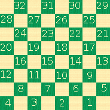

## Make a Game

### Install.
```
// package.json
// This is for development purposes only. This assumes the engine repo is in a sibling directory to the repo you're working in.
{
  ...,
  "dependencies": {
    "checkers-engine": "file:../checkers-engine",
    ...
  }
}
```

### Create.
```
const game = GameMaker.create(0)
```

The `0` represents an index in the game types array. Here's a list of game types:
0. Regular Checkers

The game types array is in `src/Game/GameConstants.ts:GAME_TYPES`.

You can also pass a full game options object to the maker, instead of a game type index, if you want:
```
const game = GameMaker.create({
  board: {
    height: 8,
    width: 8
  },
  initialPositions: [
    [1, 2, 3, 4, 5, 6, 7, 8, 9, 10, 11, 12],
    [32, 31, 30, 29, 28, 27, 26, 25, 24, 23, 22, 21]
  ]
})
```

The two arrays of `initialPositions` represent the token positions for each of the two players, represented as tile displayIds. Tile display ids are assigned by numbering the valid tiles, right to left and bottom to top, like this:



However you create your game, you'll receive an object that looks something like this:
```
{
  board: Board {
    height: 8,
    tiles: [
      Tile {
        col: 7,
        displayId: false,
        positionId: "c7r0",
        row: 0,
        tokenId: "",
        valid: false
      },
      Tile {
        col: 6,
        displayId: 1,
        positionId: "c6r0",
        row: 0,
        tokenId: "0-0",
        valid: true
      },
      ...
    ],
    width: 8
  },
  displayName: 'Regular Checkers',
  players: [
    Player {
      id: 0,
      tokens: [
        Token {
          id: "0-0",
          king: false,
          ownerId: 0,
          position: 1
        },
        ...
      ]
    },
    Player {
      id: 1,
      tokens: [
        Token {
          id: "1-0",
          king: false,
          ownerId: 0,
          position: 32
        },
        ...
      ]
    }
  ],
  type: "regular"
}
```